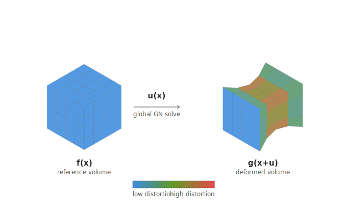

# voxelDVC



Matrix-free, GPU-accelerated (CuPy) Digital Volume Correlation. Given a
reference volume `f` and a deformed volume `g` of the same specimen
before/after loading, it recovers the displacement field `u(x)` satisfying
`f(x) = g(x + u(x))` on a structured Hex8 finite-element mesh with linear
(trilinear) basis functions.

## How it works

- **Matrix-free**: the correlation Hessian, and both regularizers
  (Laplacian or equilibrium-gap), are sums of rank-1 outer products over
  voxel-center quadrature points — never assembled into a global
  sparse/dense matrix. Every linear operator is a `matvec` evaluated on the
  fly from implicit, structured-grid connectivity (no stored connectivity
  array), and solved with Jacobi-preconditioned Conjugate Gradient.
- **Linear (Hex8) basis functions**: displacement is interpolated between
  mesh nodes by trilinear shape functions; quadrature points coincide
  exactly with image voxel centers, so each element's `(h+1)^3` voxels vote
  once (via trapezoidal weights) into the nodal unknowns at its 8 corners.
- **Gauss-Newton + multiscale**: solved with Besnard-Hild-Roux-style
  Gauss-Newton, through a coarse-to-fine image pyramid with FFT/affine
  pre-alignment to seed large rigid/affine displacements before the finest
  scale runs.
- **GPU-only**: no CPU/SciPy assembly path; CuPy is required.

See [docs/TUTORIAL.md](docs/TUTORIAL.md) for the full theory, output-file
reference, and validation results.

## Installation

```bash
pip install -e ".[gpu,viz]"
```

- `gpu` pulls in `cupy-cuda12x[ctk]` — pick a different CuPy wheel in
  `pyproject.toml` if it doesn't match your CUDA toolkit (GPU support is
  required; there is no CPU fallback).
- `viz` pulls in `napari[pyqt]`, `tifffile`, `matplotlib` for the viewer
  subcommands.
- `all` installs both extras.

This installs the `voxeldvc` console script; run `voxeldvc --help` for the
full subcommand list.

## Quickstart

Correlate the bundled PA6GF30 CT pair (`assets/PA6GF30_0.npy` /
`assets/PA6GF30_1.npy`) in two commands from the repository root:

```bash
voxeldvc preprocess assets/PA6GF30_0.npy assets/PA6GF30_1.npy --output-dir test
voxeldvc run test
```

`preprocess` estimates the affine alignment between the two volumes, crops
to their valid overlap region, and snaps it to an integer multiple of the
element size `h`. `run` then solves the multiscale DVC problem and writes
the recovered displacements, strains, and diagnostic masks into `test/`.
Visualize the result:

```bash
cd test && voxeldvc view-deformed
```

See [docs/TUTORIAL.md](docs/TUTORIAL.md) §3 for the annotated step-by-step
walkthrough with full console output and an explanation of every output
file.
